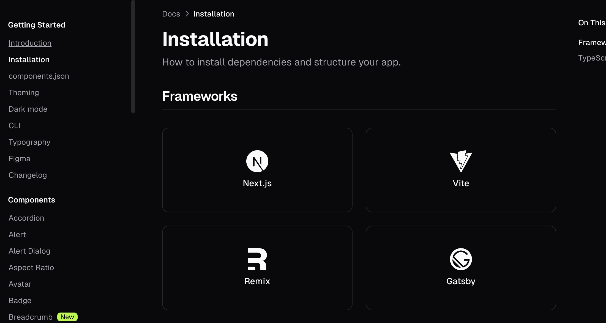

#### 需求分析

今天尝试使用[`shadcn/ui`](https://ui.shadcn.com/)这个号称最灵活的 UI 组件库，需求很简单：实现一个表头固定，表格内容可以滚动的表格就行了。

#### 开始动手

首先，我么打开官网可以找到对应的安装页面，找到我们对应脚手架，之后按照指示安装好对应依赖就好了。


#### 引入表格

我们可以通过下面这个指令引入 shadcn 的表格组件

```bash
pnpm dlx shadcn-ui@latest add table
```

如果你执行成功了，那么你将会在 '/src/components/ui'目录下看到这个组件 table.tsx，没错它就是我们要用的表格组件

#### 总结

最后我们可以得到这样的一串拥有滚动表格内容的表格了，整体来说这个组件库给我的感觉就是一个灵活性很强的毛坯房，可以随意自己装修，如果是要进行 B 端比较规范化的业务开发还是首推 antd，如果有较高的定制化需求，那么不妨大胆尝试下 shadcn 说不定会给你惊喜。

```tsx
import {
  Table,
  TableBody,
  TableCaption,
  TableCell,
  TableHead,
  TableHeader,
  TableRow,
} from '@/components/ui/table';
interface IHeadItem {
  name: string;
  value: string;
}
import { tableHeader1, tableHeader2, tableBody1, tableBody2 } from './contant';
function App() {
  const structureTable = (
    _tableHeader: IHeadItem[],
    _tableBody: Record<string, any>[]
  ) => {
    return (
      <Table className="border-collapse border border-gray-300">
        <TableHeader className=" table w-[100%] table-fixed  bg-gray-100 ">
          <TableRow>
            {_tableHeader.map((headItem: IHeadItem) => (
              <TableHead key={headItem?.value} className="w-[120px]">
                {headItem.name}
              </TableHead>
            ))}
          </TableRow>
        </TableHeader>
        <TableBody className=" block h-[calc(50vh-50px)] overflow-x-auto w-[100%]">
          {_tableBody.map((bodyItem, index) => (
            <TableRow
              key={index}
              className=" table w-[100%] table-fixed font-medium "
            >
              {_tableHeader.map((headItem) => (
                <TableCell key={headItem?.value}>
                  {headItem?.value ? bodyItem[headItem?.value] : '--'}
                </TableCell>
              ))}
            </TableRow>
          ))}
        </TableBody>
      </Table>
    );
  };
  return (
    <div className="flex flex-col h-[100vh] ">
      {structureTable(tableHeader1, tableBody1)}
      {structureTable(tableHeader2, tableBody2)}
    </div>
  );
}

export default App;
```
